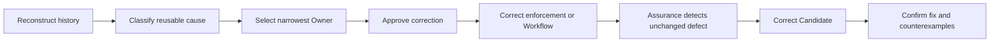

Build the smallest approved Workflow that makes independent runs follow the Contract.

## Route

Applicable work routes to:

| Work                                                             | Reference                                                  |
| ---------------------------------------------------------------- | ---------------------------------------------------------- |
| Diagnosing behavior from current or previous agent conversations | [Conversation history](references/conversation-history.md) |
| Existing or custom static enforcement                            | [Enforcement](references/enforcement.md)                   |
| Explicit final workflow evaluation                               | [Evaluation](references/evaluation.md)                     |
| Codex prompting, configuration, skills, or agents                | [Codex](references/codex.md)                               |

## Ownership

| Owner                  | Surface                                                                                 |
| ---------------------- | --------------------------------------------------------------------------------------- |
| `AGENTS.md`            | Unconditional authority, vocabulary, loading, collaboration, scope, validation, writing |
| Skill `description`    | Sole loading trigger; never restates the body                                           |
| Agent `description`    | Dispatch trigger plus non-derivable required inputs                                     |
| Native agent body      | Bounded execution procedure after dispatch                                              |
| Domain skill body      | Conditional workflow or engineering guidance                                            |
| Skill reference        | One genuinely conditional branch                                                        |
| Platform configuration | Runtime capability and tool policy                                                      |
| Static enforcement     | Mechanically detectable repository constraints                                          |
| Evaluation             | Generic proof of routing, behavior, integration, and stability                          |

## Construction

| Lead        | Requirement                                                                                                                                              |
| ----------- | -------------------------------------------------------------------------------------------------------------------------------------------------------- |
| Preserve    | Keep unaffected behavior and domain-specific rules, verified CLI instructions, canonical examples, progressive references, schemas, and evidence gates.  |
| Select      | Keep frequent, architectural, or routinely misapplied guidance only.                                                                                     |
| Classify    | Apply the `AGENTS.md` Writing grammar to each retained information type.                                                                                 |
| Label       | Use a precise leading word when it reduces interpretation cost.                                                                                          |
| Route       | Put capabilities in configuration, mechanical behavior in maintained static enforcement, and conditional guidance in one progressive reference.          |
| Deduplicate | Remove no-op instructions, generic wrappers, ambiguous headings, metadata restatement, 1:1 duplication, semantic duplication, and conflicting ownership. |
| Couple      | Update the Owner, call paths, configuration, enforcement, tests, and evaluation fixtures required by the changed behavior.                               |

| Artifact            | Retain only                                                                   |
| ------------------- | ----------------------------------------------------------------------------- |
| `AGENTS.md`         | Unconditional repository policy                                               |
| Skill description   | Loading trigger                                                               |
| Agent description   | Dispatch trigger and non-derivable input                                      |
| Skill or agent body | Conditional procedure or bounded execution                                    |
| Reference           | One conditional branch                                                        |
| Configuration       | Runtime capability and tool policy                                            |
| Enforcement         | Mechanically detectable constraint                                            |
| Evaluation          | Neutral proof of routing, behavior, integration, migration, and repeatability |

## Workflow-first correction

Apply this skill alongside `iteration` whenever reported behavior may expose a reusable Workflow defect.

**Evaluation:** Run repeated holdouts only during explicit Workflow evaluation or finalization.
