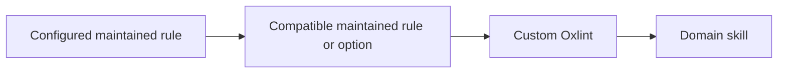

# Static enforcement

**Boundary:** Put mechanically detectable behavior in static enforcement and semantic behavior in a skill.

## Own

| Tool                          | Active owner                              | Available rules or source                            |
| ----------------------------- | ----------------------------------------- | ---------------------------------------------------- |
| TypeScript                    | `tsconfig.json`                           | `.agents/repos/typescript`                           |
| Oxlint · Oxfmt                | `vite.config.ts`                          | `.agents/repos/oxc` · `.agents/repos/vite-plus`      |
| Effect diagnostics            | `vite.config.ts`                          | `.agents/repos/effect-tsgo`                          |
| React Compiler · React Doctor | `vite.config.ts`                          | `.agents/repos/react` · `.agents/repos/react-doctor` |
| Fallow                        | `.fallowrc.json` · root `check` script    | `.agents/repos/fallow`                               |
| Custom Oxlint                 | `tools/oxlint-rules/src/oxlint-plugin.ts` | colocated tests                                      |

## Selection

Add custom Oxlint only when every gate is satisfied:

| Gate       | Requirement                   |
| ---------- | ----------------------------- |
| Frequency  | Frequent                      |
| Detection  | Precise and static            |
| Ownership  | No maintained equivalent      |
| Correction | Stable canonical construction |

| Evidence    | Requirement                                           |
| ----------- | ----------------------------------------------------- |
| Defect      | Exact invalid form and architectural reason           |
| Proof       | Failing fixtures and valid counterexamples            |
| Boundary    | Unsupported cases and narrowest syntax and path scope |
| Correction  | One canonical Construction                            |
| Suppression | Irreducible, narrow, inline, and reasoned             |
