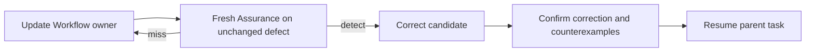
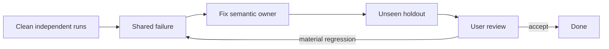

# Agent and skill evaluation

Apply one protocol uniformly to every discovered agent and skill. Derive minimum neutral fixtures from its metadata and body; never hard-code component-specific evaluation policy.

## Protocol

1. **Routing:** From metadata alone, prove the component is selected for a minimal positive trigger, rejected for a near-miss negative trigger, and does not collide with another component. Treat routing as the primary result.
2. **Handoff:** Prove a selected skill receives the necessary task context and a selected agent receives every input promised by its description, without body-only knowledge leaking into the parent decision or inherited conversation supplying undeclared context.
3. **Behavior:** After selection, prove the body follows its contract, authority, tool boundaries, reference routing, and output contract on the smallest representative task.
4. **Integration:** Cross-check AGENTS.md, metadata, bodies, references, configuration, enforcement, and neighboring components. Reject semantic duplication, conflicting owners, stale APIs, unsafe exceptions, and metadata drift.
5. **Consistency:** Run at least three clean independent trials and require convergence through ordinary long context, local steering, and reconciliation. Run every agent trial through a fresh ephemeral instance with `fork_turns: none`; never reuse an instance. A Workflow component must not route or behave correctly only by chance.

Migration evaluation additionally proves that every unaffected prior behavior remains intact. Use task-specific fixtures only as inputs to this generic protocol.

## Workflow-first proof

Do not disclose the expected defect, suggested finding, or planned code fix to the pre-fix Assurance pass. A semantic instruction correction is insufficient when an independent pass cannot derive the defect from the changed Workflow. Static enforcement additionally requires invalid fixtures, valid counterexamples, and unsupported cases.

Scale beyond three trials only when observed variance or risk requires it. Evaluate trajectory and result; stop when unseen holdouts have no material regression.

## Fixture boundary

| Evidence                | Allow                                                                                                              | Exclude                                                                                                   |
| ----------------------- | ------------------------------------------------------------------------------------------------------------------ | --------------------------------------------------------------------------------------------------------- |
| Diagnosis and migration | Relevant current and previous conversation history, instructions, metadata, enforcement, and authoritative sources | Unrelated product code and invented policy                                                                |
| Unseen holdout          | Neutral synthetic task and minimum fixture                                                                         | Source conversations, prior-run artifacts, production implementations, Git history, and expected findings |

Reject fixtures requiring invented domain values, defaults, compatibility, policy, or product structure.
