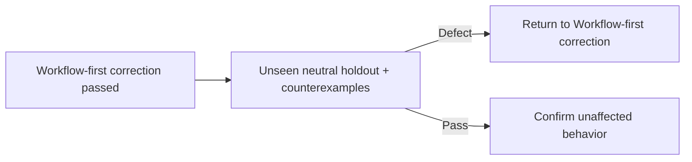

# Agent and skill evaluation

Use the smallest neutral fixture derived from each agent or skill metadata and body.

| Gate          | Proof                                                                                                                                                            |
| ------------- | ---------------------------------------------------------------------------------------------------------------------------------------------------------------- |
| Routing       | A minimal positive trigger selects the component; a near miss does not; no collision or body policy exists in metadata.                                          |
| Behavior      | The component receives only Material delta, derives available facts, and follows authority, tool, reference, and artifact boundaries without undeclared context. |
| Integration   | `AGENTS.md`, metadata, bodies, references, configuration, enforcement, and neighbors have compatible interfaces and one Owner per policy.                        |
| Repeatability | Three independent runs converge through long context, local steering, and reconciliation; approval does not leak to a successive action.                         |

| Neutral holdout      | Required behavior                                                                                                                                                |
| -------------------- | ---------------------------------------------------------------------------------------------------------------------------------------------------------------- |
| Writing persistence  | Primary and subagent output remains compact, complete, unambiguous, and schema-conformant through a long tool-heavy turn.                                        |
| Compaction           | After lossy compaction, each retained representation preserves its relationships, order, branching, mappings, hierarchy, scope, and validity without prose glue. |
| Approved execution   | A complete approved plan does not load `iteration`.                                                                                                              |
| Product design       | `engineering` loads for general design; `deslop` additionally loads only for this repository's architecture or visual system.                                    |
| Unrelated delegation | Independent work uses fresh applicable agents and preserves parallel dispatch.                                                                                   |
| Related delegation   | A follow-up reuses its agent unless that assignment's evidence changed; a correction requires fresh Assurance only for affected proof questions.                 |
| Assurance scope      | Each Assurance receives one bounded proof question; one request combining independent Owners or proof questions fails evaluation.                                |
| Workflow reload      | Agent, skill, instruction, or configuration changes require an OpenCode restart before proof.                                                                    |
| Research ownership   | Explorer returns only decision-relevant findings; the main thread reads files it edits and rereads evidence only when required.                                  |
| Research depth       | A defect investigation tests plausible causes and identifies the reusable cause and sole owner instead of stopping at a symptom.                                 |
| Representation scope | A request to shorten communicated paths does not change stored reference declarations.                                                                           |
| Failure reporting    | Each agent reports every execution failure to its parent; the primary reports each distinct failure once, including recovered failures.                          |
| Continuation         | Completion of a secondary objective continues the actionable approved parent objective.                                                                          |
| Approval isolation   | Approval covers its objective and coupled corrections; it does not authorize a successive unrelated or expanded action.                                          |

| Holdout input              | Status   |
| -------------------------- | -------- |
| Source conversations       | Excluded |
| Prior-run artifacts        | Excluded |
| Production implementations | Excluded |
| Git history                | Excluded |
| Expected findings          | Excluded |
| Invented domain policy     | Excluded |
