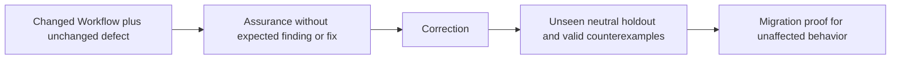

# Agent and skill evaluation

Use the smallest neutral fixture derived from each agent or skill metadata and body.

| Gate          | Proof                                                                                                                                                            |
| ------------- | ---------------------------------------------------------------------------------------------------------------------------------------------------------------- |
| Routing       | A minimal positive trigger selects the component; a near miss does not; no collision or body policy exists in metadata.                                          |
| Behavior      | The component receives only Material delta, derives available facts, and follows authority, tool, reference, and artifact boundaries without undeclared context. |
| Integration   | `AGENTS.md`, metadata, bodies, references, configuration, enforcement, and neighbors have compatible interfaces and one Owner per policy.                        |
| Repeatability | Three independent runs converge through long context, local steering, and reconciliation; approval does not leak to a successive action.                         |

**Holdout exclusion:** Source conversations, prior-run artifacts, production implementations, Git history, expected findings, and invented domain policy.
