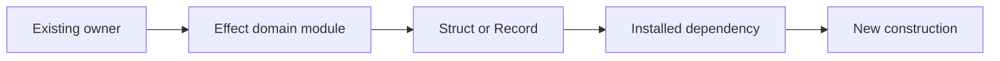

Effect is the language and functional mental model: Effect owns behavior, immutable data, state, resources, concurrency, and failure; servers are authoritative; streaming RPC synchronizes Atom; React presents; adapters translate external interfaces.

- Trust typed values.
- Preserve intact typed values; transform shape only when the contract requires it.
- Omit states excluded by types or schemas.
- Propagate the first reachable failure; retry or recover only when required by the contract.
- Keep arguments, props, service values, and returned values immutable without `readonly` syntax.
- Remove dead, superseded, semantically duplicated, contract-obsolete, or compatibility-only surface across the coupled path.
- Verify dependency signatures from authoritative cloned source; never infer from memory.

## Construction



### Narrowest owner

```ts
// BAD
const user = input.session.user
const id = user.id
const result = load(id)

return result

// GOOD
return load(input.session.user.id)
```

### Intact objects

```tsx
// BAD
function Row(props: {id: Item['id']; title: Item['title']}) {
	return <button data-id={props.id}>{props.title}</button>
}

// GOOD
function Row(props: {item: Item}) {
	return <button data-id={props.item.id}>{props.item.title}</button>
}
```

One independent leaf remains a direct prop. Identity, actions, or multiple cohesive fields retain their existing owner. Tuple and array destructuring remain canonical.

### Inference

```ts
// BAD
const [target, setTarget] = useState<ReviewTarget>(ReviewTarget.make({}))

// GOOD
const [target, setTarget] = useState(ReviewTarget.make({}))
```

```ts
// BAD
const normalize = flow(String.trim, String.toLowerCase)

export function Label(props: {value: string}) {
	return <span>{normalize(props.value)}</span>
}

// GOOD
export function Label(props: {value: string}) {
	return <span>{pipe(props.value, String.trim, String.toLowerCase)}</span>
}
```

Module scope: schema, service, component, Atom, cache, `RcMap`, `LayerMap`, recursive or independently shared large shape, expensive shared computation, identity, or lifecycle.

### Direct names

```tsx
// BAD
import {Status as StatusSchema} from './schema.ts'

type StatusValue = typeof StatusSchema.Type

// GOOD
import {Status} from './schema.ts'

function Badge(props: {status: Status}) {
	return <span>{props.status}</span>
}
```

Name distinct owners; omit import, type, property-access, and binding aliases. Schema pairs are the sole mandatory same-name type declarations.

## References

Read every matching reference completely once with `cat` before acting. Open the linked path directly relative to this file; never discover this directory. Continue a read only after reported truncation.

| Work                                                                                 | Reference                                 |
| ------------------------------------------------------------------------------------ | ----------------------------------------- |
| Effect operation selection, composition, Stream, tracing, errors, and concurrency    | [Effect](references/effect.md)            |
| Schema-owned public shapes, public service interfaces, and RPC contracts             | [Contracts](references/contracts.md)      |
| External boundary decoding and missing values                                        | [Effect data](references/effect-data.md)  |
| Service implementations, Layers, resources, SubscriptionRef, keyed instances, caches | [Services](references/effect-services.md) |
| Router, RPC client, Atom, React                                                      | [Frontend](references/react.md)           |
| Service or helper behavior tests                                                     | [Testing](references/testing.md)          |
| Product interaction or visual design                                                 | [UI design](references/ui-design.md)      |
| Package topology, manifests, dependencies, scripts, exports, CLI, generated files    | [Workspace](references/workspace.md)      |

## Output

Return only the complete contract-preserving construction or material defect, its earliest shared cause, and unresolved reachable failures.
