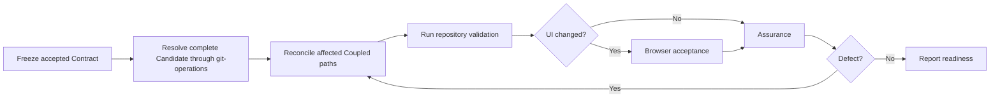

| Lead      | Rule                                                                                                                          |
| --------- | ----------------------------------------------------------------------------------------------------------------------------- |
| Reconcile | Remove abandoned alternatives, iteration layers, dead paths, temporary compatibility, and governing-rule violations.          |
| Dispatch  | Give Browser the bounded UI task and runtime context. Give Assurance only the task-specific Contract and explicit exclusions. |
| Repeat    | Repeat validation and each applicable acceptance gate after a correction.                                                     |
