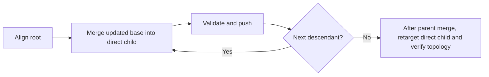

# Stacked pull requests

Keep every review boundary valid without rewriting published history.

## Topology

| Node  | Base             | Invariant                              |
| ----- | ---------------- | -------------------------------------- |
| Root  | Default branch   | Independently understandable and valid |
| Child | Immediate parent | Independently understandable and valid |

**Inspect:** Resolve the complete topology before mutation.

```bash
gh stack add
gh stack view
gh stack submit
```

In `gh stack submit`, set every pull request to draft; never use `--open`.

## Published alignment



**Conflict:** Stop when intended resolution is not provable. Apply the parent Safety table to every operation.
