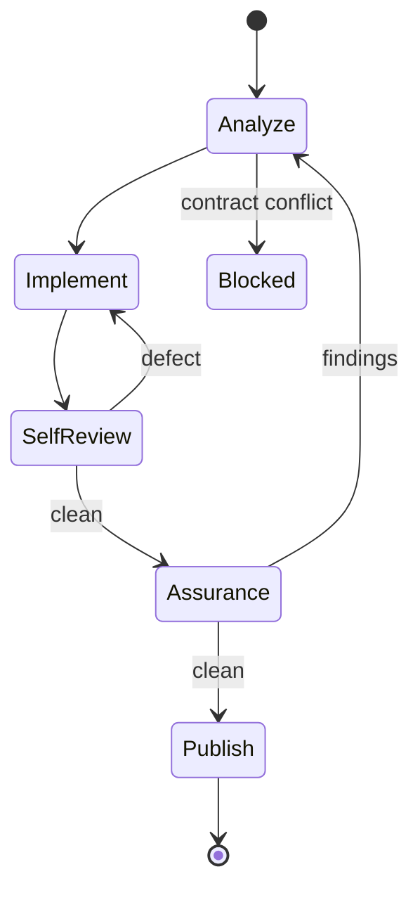

## Contract

The canonical issue is the literal desired state.

```diff
- reinterpret · expand · reduce · substitute · partially comply
- preserve superseded code · workaround · fallback
+ implement every clause
+ re-read after compaction
```

Start from a clean worktree or the explicit follow-up state. Load the engineering skill, research matching cloned APIs and local ownership independently, then map every clause to its public seam, invariant, dependency API, risk, and failure mode.

If an exact clause cannot be satisfied, stop blocked; do not substitute another result.

## Implement

Own production behavior and code quality before assurance. Inspect the complete base-to-worktree diff and every changed/untracked file against the issue and every applicable engineering reference.

## Assurance

Freeze repository edits. Spawn testing and review concurrently with `fork_turns: "none"`:

| Agent   | Model         | Effort | Prompt                  | Input                          |
| ------- | ------------- | ------ | ----------------------- | ------------------------------ |
| Testing | `gpt-5.6-sol` | low    | Load the testing skill. | issue · worktree · actual base |
| Review  | `gpt-5.6-sol` | medium | Load the review skill.  | issue · worktree · actual base |

Provide no implementation narrative, claims, previous findings, or other evaluator report. Await both without editing. A valid finding returns to root-cause analysis; rerun affected assurance against the complete candidate.

## Publish

Load the git-operations skill. After clean assurance, create one commit whose tree equals the reviewed tree, push, and create/update one draft pull request closing the issue. Create no checkpoint commit. Return only the draft pull-request URL.
