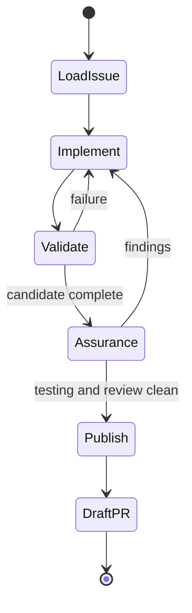

## Load issue

Treat the canonical issue as the desired-state contract. Inspect the actual worktree and relevant `.agents/repos/*`; start from a clean worktree or the user-provided follow-up state.

When the user says the issue changed, reload it and reconcile a small revision with the current candidate. An explicit reset or discard request authorizes cleaning current tracked and untracked changes before loading a replacement plan; preserve ignored environment and runtime state.

## Implement

Own all repository edits. Implement the complete issue, run focused checks while working, then run the repository validation contract. Bugs, regressions, and code-quality corrections remain implementation work.

The user may stop the task at any time.

## Assurance

Freeze repository edits. Spawn fresh generic testing and review subagents concurrently with no inherited conversation. Tell each to invoke its applicable skill and provide only:

- canonical issue;
- repository/worktree path;
- actual pull-request base, or default branch when no pull request exists;
- the complete base-to-current-worktree candidate.

Both evaluators are strict, unbiased, and adversarial. Do not provide implementation narration, success claims, prior findings, or the other report. Await both without editing.

Consolidate and adjudicate findings against the issue and current source. Apply one correction pass, then repeat affected assurance against the complete candidate until clean.

## Publish

Create exactly one commit after assurance, push, and create or update a draft pull request that closes the issue. The reviewed tree must equal the committed tree.

Never create checkpoint commits or mark the pull request ready. Return only the draft pull-request URL.
