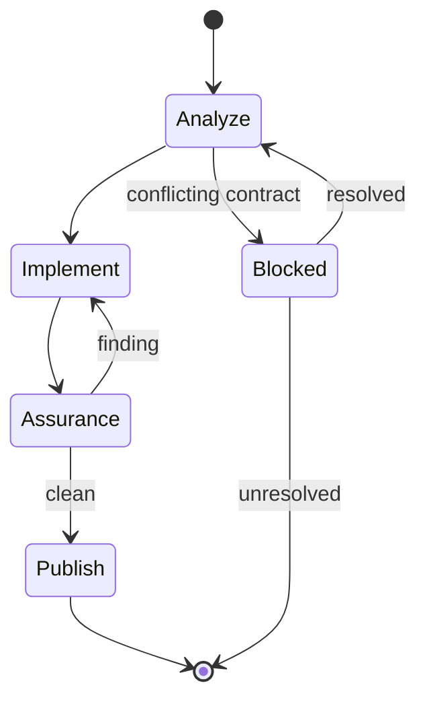

## Analyze

Map each contract clause to its owner and consumer-visible proof; stop on conflict. Re-read the contract after compaction.

Load `engineering`.

## Implement

Inspect the complete base-to-worktree diff and every changed or untracked file.

## Assurance

Freeze repository writes. Spawn independent testing and review concurrently with clean context. Give each the issue and actual base; both inspect the shared complete worktree. After any repository write, rerun both against the complete candidate.

## Publish

Load `git-operations`. Commit the reviewed tree, push, and create or update one draft pull request closing the issue. Return only its URL.
