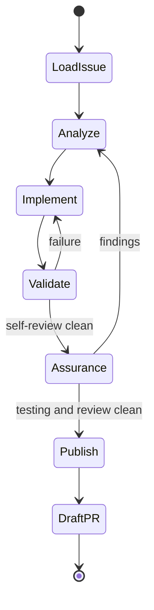

## Load issue

Treat the canonical issue as the desired-state contract. Inspect the actual worktree and relevant `.agents/repos/*`; start from a clean worktree or the user-provided follow-up state.

When the user says the issue changed, reload it and reconcile a small revision with the current candidate. An explicit reset or discard request authorizes cleaning current tracked and untracked changes before loading a replacement plan; preserve ignored environment and runtime state.

## Analyze

Before editing, map issue clauses to current ownership, invariants, public seams, dependency APIs, material risks, and plausible failure modes. Resolve assumptions from current source, relevant cloned or installed source, and maintained documentation. Ask only when an unresolved choice changes the contract.

## Implement

Own all repository edits. Produce complete production-ready working code, run focused checks while working, then run the repository validation contract.

Immediately before assurance, inspect the complete actual-base-to-worktree diff and every changed or untracked file against every applicable engineering reference. Explicitly verify boundary decoding, typed failures and messages, duplication, and authorization or safety. Assurance is exceptional verification of an implementation-owned clean candidate.

The user may stop the task at any time.

## Assurance

Enter assurance only after implementation, validation, and self-review are complete. Freeze repository edits. Spawn fresh generic testing and review subagents concurrently with no inherited conversation. Tell each to invoke its applicable skill and provide only:

- canonical issue;
- repository/worktree path;
- actual pull-request base, or default branch when no pull request exists;
- the complete base-to-current-worktree candidate.

Both evaluators are strict, unbiased, adversarial, exceptional independent verification—not a repair backlog. Do not provide implementation narration, success claims, prior findings, or the other report. Await both without editing.

Consolidate and adjudicate findings against the issue and current source. A valid finding returns the candidate to analysis: re-evaluate the root cause and full solution, never apply a mechanical checklist patch, workaround, suppression, or skill or validation evasion. Repeat affected assurance against the complete candidate until clean.

## Publish

Create exactly one commit after assurance, push, and create or update a draft pull request that closes the issue. The reviewed tree must equal the committed tree.

Never create checkpoint commits or mark the pull request ready. Return only the draft pull-request URL.
