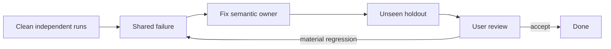

# Instruction evaluation

## Structure

| Owner       | Content                                                      |
| ----------- | ------------------------------------------------------------ |
| Frontmatter | Name · exact trigger · capability                            |
| `SKILL.md`  | Cross-branch outcome · construction · exact reference routes |
| Reference   | One conditional branch safely omitted elsewhere              |

Group related topics. One policy, one semantic owner. Link every reference directly from its owner `SKILL.md`, one level deep, with an exhaustive predicate.

Use the minimum surrounding example. Cross-check every instruction and valid example against enforcement, other examples, and current authoritative source. Reject stale APIs, incompatibility, semantic duplication, unsafe exceptions, trigger collision, and metadata drift.

## Protocol

Evaluate task-specific fixtures through only the applicable generic lenses:

| Lens      | Question                                                                                         |
| --------- | ------------------------------------------------------------------------------------------------ |
| Selection | Was the correct agent, skill, reference, model, effort, and context selected?                    |
| Process   | Was authority used without assumptions, repeated reads, failed guesses, or avoidable churn?      |
| Result    | Was the first pass correct, minimally constructed, and valid under instructions and enforcement? |
| Stability | Do clean runs converge and preserve intent through long context, migration, and reconciliation?  |

Migration evaluation compares against the previous semantic contract. Migration parity and exact command validity are evidence within the four lenses, never separate hard-coded workflows.

Run at least three independent clean runs for semantic or routing changes; scale with variance and risk. Evaluate trajectory and result. Stop when unseen holdouts have no material regression. Keep fixtures task-specific and the protocol generic.

## Fixture boundary

| Allow                                                  | Exclude                            |
| ------------------------------------------------------ | ---------------------------------- |
| Instructions and skill metadata                        | `apps/*`                           |
| Cloned repositories                                    | Production package implementations |
| Enforcement configuration and custom-rule source/tests | Git and conversation history       |
| Neutral synthetic task and fixture                     | Other-run artifacts                |

Reject fixtures requiring invented domain values, defaults, compatibility, policy, or product structure.

## Output

Present material failures, shared causes, corrections, and changed holdout results. Omit unchanged artifacts and aggregate scores that hide failures.
