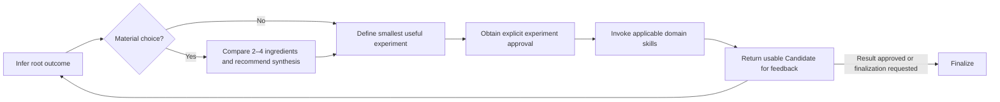

| Lead     | Rule                                                                                                                 |
| -------- | -------------------------------------------------------------------------------------------------------------------- |
| Question | Ask only unresolved questions that can change the experiment; ask independent questions together.                    |
| Exclude  | Define revised dimensions and material exclusions before approval.                                                   |
| Surface  | Present a simpler mechanism when evidence supports it.                                                               |
| Defer    | Put an unrequested possibility in a `> [!NOTE]` callout labeled `Outside current scope`; discard it unless selected. |
