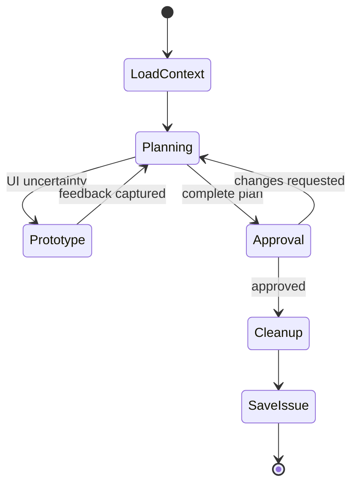

Resolve desired behavior, scope, architecture, interfaces, acceptance, and material risks with the user. Planning does not own implementation sequence, bugs, or routine code quality.

## Load context

Start from a clean worktree. Read current source, relevant `.agents/repos/*`, current issues, and the existing canonical issue when replanning. Treat proposed solutions as hypotheses.

Ask one material question at a time only when undiscoverable input changes the desired state. Recommend a direction once evidence is sufficient.

## Prototype

Prototype UI uncertainty with repository DevTools. Keep variants implementation-equivalent and compare interaction or layout rather than decoration.

Prototype code is disposable. On approval, discard every tracked and untracked prototype change and verify the worktree is clean before persistence. Preserve ignored environment and runtime state.

## Approval

Present one complete GFM plan. Give each fact one representation; a diagram is not followed by a prose mirror. Feedback replaces the complete checkpoint rather than appending a delta.

Approval authorizes creating a new canonical GitHub issue or replacing the complete body of the issue being replanned. Persist outcome, decisions, rationale, behavior, interfaces, scope, acceptance, constraints, dependencies, risks, and meaningful rejected alternatives.

Exclude transcripts, prototype code, local plan files, implementation order, and recoverable repository facts. Stop after issue persistence.
