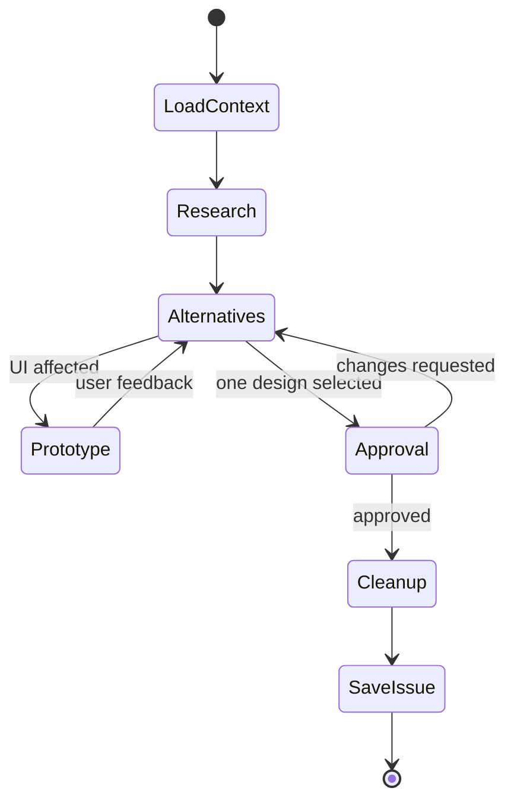

Convert the initial request into the smallest complete solution to its root problem. Planning owns desired behavior, scope, architecture, interfaces, acceptance, constraints, and material risks—not implementation sequence, bugs, or routine code quality.

## Load context

Start from a clean worktree. Research current source, relevant `.agents/repos/*`, current issues, and the existing canonical issue when replanning. Research cloned and local source independently; treat proposed solutions and existing local workarounds as hypotheses.

Explore library-native design, different architectures, smaller features, larger coherent boundaries, removal, and different UI interactions. Reject initial-idea anchoring, local-pattern bias, cosmetic alternatives, equivalent duplicates, and premature implementation.

Ask one material, non-duplicate question at a time only after research when undiscoverable input changes behavior, interface, UI, ownership, or a fixed constraint. Recommend one direction once evidence is sufficient.

## Prototype

Prototype every affected UI with repository DevTools. Compare meaningful behavior, interaction, and layout variants rather than decoration; finalize no UI the user has not reviewed.

Prototype code is disposable. On approval, discard every tracked and untracked prototype change and verify the worktree is clean before persistence. Preserve ignored environment and runtime state.

## Approval

Present one complete GFM plan at software-architect altitude: the issue is a pseudo-code specification for a black-box implementer. Specify observable behavior, public signatures, typed requests/success/errors, routes and search, state transitions, ownership, lifecycle, accepted UI, and fixed constraints. Leave function bodies, local variables, pipeline mechanics, component decomposition, and exact edited lines to implementation.

Approval authorizes creating a new canonical GitHub issue or replacing the complete body of the issue being replanned. Persist outcome, decisions, rationale, behavior, interfaces, scope, acceptance, constraints, dependencies, risks, and meaningful rejected alternatives.

Include every material fact the source, skills, and workflow cannot supply. Record rejected alternatives and their decisive failures. Exclude transcripts, backtracking, prototype code, local plan files, workflow or validation narration, implementation order, exact edited lines, and recoverable repository facts. Stop after issue persistence.
