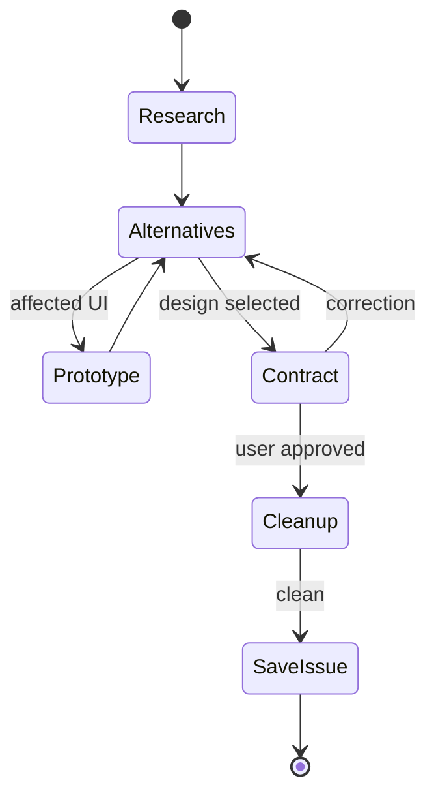

Find the smallest complete solution to the root problem. Resolve behavior, scope, architecture, interfaces, UI, acceptance, constraints, and material risk.



## Resolve

- Start with a clean worktree.
- Read related issues and the canonical issue when replanning.
- Research relevant cloned APIs and local product ownership independently.
- Treat the initial proposal and existing local shape as hypotheses.
- Compare library-native design, removal, smaller scope, larger coherent boundaries, different architectures, and different interactions.
- Ask one researched, non-duplicate question at a time when undiscoverable input changes behavior, interface, UI, ownership, or a fixed constraint.
- Recommend one design after material alternatives have decisive evidence.

## Prototype

Prototype every affected UI in repository DevTools. Present behavior, interaction, and layout for user review.

## Contract

```text
Include
  always   — outcome · behavior · scope · constraints · acceptance
  affected — UI · architecture · data model · ownership · lifecycle · state transitions
             public signatures · typed request/success/failure · route/search · risks
  decision — decisive reasoning · rejected alternatives

Exclude
  transcript · backtracking · prototype code · workflow · validation
  implementation order · function bodies · local variables · exact lines
  facts recoverable from source or loaded instructions
```

The issue must be sufficient from a clean implementation context and allow one interpretation.

Thread output contains the current decision delta; the persisted issue contains the complete clean-context contract.

User approval authorizes replacing the complete replanned issue body or creating one canonical issue. Before persistence, discard all tracked and untracked prototype changes and verify a clean worktree; preserve ignored runtime state. Load the git-operations skill, persist the issue, then stop.
