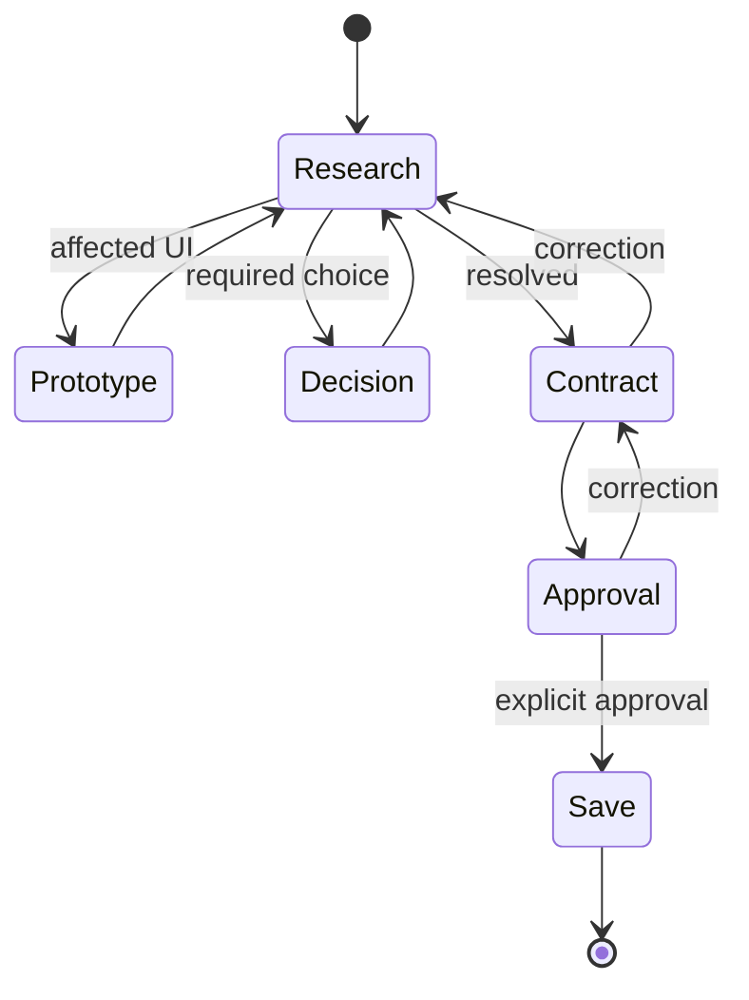

## Resolve

1. Load `engineering`; inspect related issues, ownership, and matching cloned source.
2. Compare removal, current dependency capability, and repository-owned behavior.
3. Present only evidence changing a decision.
4. Prototype affected UI in repository DevTools; discard before persistence.

## Output

| State     | Output                                           | Write              |
| --------- | ------------------------------------------------ | ------------------ |
| Research  | result → consequence → recommendation            | none               |
| Decision  | evidence → `## Decision` → one required question | none               |
| Prototype | rendered interaction                             | disposable preview |
| Contract  | smallest standalone GFM issue                    | none               |
| Save      | issue URL                                        | canonical issue    |

## Contract

Retain observable outcome, material interface, ownership, lifecycle, architecture, and exclusions preventing a likely wrong path. Place acceptance beside its behavior.

> [!IMPORTANT]
> Save this issue?

An explicit affirmative authorizes persistence. Load `git-operations`; verify a clean worktree; delegate persistence to a full-history fork inheriting model and effort.
