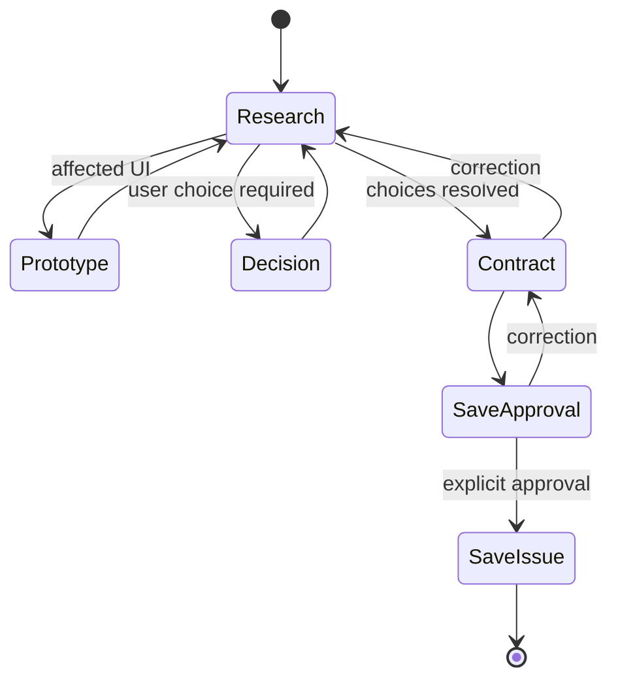

Find the smallest complete solution to the root problem.

## Resolve

- Begin clean. Read related issues; inspect local ownership and cloned APIs.
- Treat proposals and current shape as hypotheses. Compare removal, native, smaller/larger coherent, architecture, and interaction; recommend one evidenced design.
- Keep research, mechanics, and rejections internal unless they change the user decision.

## Output

| State | User sees | Write |
|---|---|---|
| Research · Decision | `result → consequence → recommendation → ## Decision`; one necessary question | None |
| Prototype | Affected UI in repository DevTools | Disposable preview |
| Contract | Final issue after every decision resolves | None |
| SaveIssue | Persistence result | Canonical issue |

Before decisions resolve: no status, acceptance, implementation detail, complete issue, or product/configuration/instruction edits.

## Issue

| Retain only when unrecoverable | Exclude |
|---|---|
| Outcome/behavior · material interface/ownership/lifecycle/architecture · fixed constraint/exclusion/risk · reasoning preventing a wrong path | Transcript/backtracking · prototype code · workflow/validation/order · private mechanics/lines · source facts · repetition |

Persist the smallest GFM contract allowing one clean-context implementation. Use no template. Keep acceptance beside behavior only when it adds a boundary and rejections only when likely to recur. Remove every redundancy.

Present the final issue once, then end with:

> [!IMPORTANT]
> Save this issue?

Only an explicit affirmative response to this question authorizes persistence. Before saving, discard prototypes, verify a clean worktree while preserving ignored runtime state, load `git-operations`, persist, and stop.
