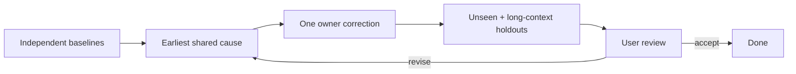

# Instruction evaluation

## Structure

| Owner       | Content                                                      |
| ----------- | ------------------------------------------------------------ |
| Frontmatter | Name · exact trigger · capability                            |
| `SKILL.md`  | Cross-branch outcome · construction · exact reference routes |
| Reference   | One conditional branch safely omitted elsewhere              |

Group related topics. One policy, one semantic owner. Link every reference directly from its owner `SKILL.md`, one level deep, with an exhaustive predicate.

## Examples

```ts
// BAD: same behavior; one isolated failure
const output: Result = compute(input)

// GOOD: direct refactor; inferred type; verified API; valid under every instruction
const output = compute(input)
```

Use the minimum surrounding code. Imports are outside example scope. Rewrite examples requiring explanatory prose.

Cross-check every instruction and GOOD example against enforcement, other examples, and current cloned source. Reject stale APIs, incompatibility, semantic duplication, unsafe exceptions, trigger collision, and metadata drift.

## Fixture

| Allow                                                  | Exclude                            |
| ------------------------------------------------------ | ---------------------------------- |
| Instructions and skill metadata                        | `apps/*`                           |
| Cloned repositories                                    | Production package implementations |
| Enforcement configuration and custom-rule source/tests | Git and conversation history       |
| Neutral synthetic task and fixture                     | Other-run artifacts                |

Reject fixtures requiring invented domain values, defaults, compatibility, policy, or product structure.

## Runs

- Run at least three independent clean generations for semantic or routing changes; increase count with breadth, variance, and risk.
- Use smaller proof only for mechanical edits with unchanged semantics and routing.
- Use the primary model for unseen holdouts.
- Invalidate forbidden-source access.

| Measure           | Evidence                                                                    |
| ----------------- | --------------------------------------------------------------------------- |
| Routing           | Selected skills and missed/extra invocation                                 |
| Reference loading | Ordered reads; partial, repeated, speculative, or directory-discovery calls |
| Assumptions       | Unsupported choices visible in actions or artifacts                         |
| Trajectory        | Stalls, tool failures, edit/correction count, fixer churn                   |
| First pass        | Contract, owner, primitive, boundary, lifetime, current API, minimality     |
| Final             | Behavior, architecture, semantic/output adherence, remaining cleanup        |
| Persistence       | Long-context and post-compaction adherence                                  |

## Correction



Treat a cause as systemic when repeated independently or matching a repeated user correction. Accept only improved first-pass trajectory, non-regressed final quality, passing holdouts, and user approval.

## Output

Present material failures, shared causes, corrections, and changed holdout results. Omit unchanged artifacts and aggregate scores that hide failures.
