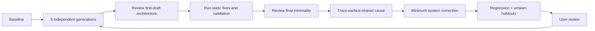

# Instruction evaluation

## Structure

```text
frontmatter
  name · concrete trigger and capability

SKILL.md
  outcome · grouped routes · decisions after invocation

reference.md
  titled BAD/GOOD slices · real exceptions · exact cloned source
```

Route a reference only when a task can omit it safely. Group related topics; retain one policy at one owner.

## Examples

```text
title
→ connected BAD/GOOD code block
→ exact cloned source paths
```

```text
BAD:
same behavior as GOOD
one coherent failure
minimum context

GOOD:
direct refactor of BAD
current verified APIs
cross-rule valid
no unnecessary abstraction
```

Coding rule = title + BAD/GOOD. Rewrite an example that requires prose to disambiguate it.

## Cross-check

```text
all instructions
+ active static enforcement
+ linked cloned source
+ every other GOOD example
```

Reject: incompatible examples · stale APIs · duplicate policy · unsafe exceptions · trigger collisions · metadata drift.

## Blind evaluation

Generation context:

```text
AGENTS.md
+ all skills and references
+ cloned repositories
+ active static config and custom rule source/tests
+ neutral synthetic task
- apps/*
- production package implementation source
- git history
- conversation history
```



Run at least five clean agents per task; parallelize available slots. Use an inexpensive model for broad generation and the configured primary model for holdouts. Keep instructions model-agnostic.

```text
Observe: first draft · diagnostics · automatic changes · final architecture · user correction
Trace: earliest decision producing the failure
Compare: instructions · examples · source route · static enforcement · validation
Correct: earliest shared cause with the smallest system change
Prove: baseline · affected regressions · unseen holdouts
```

First draft: correct architecture, ownership, primitives, boundaries, lifetime, and current APIs.

Final result: full validation; no remaining architectural repair, duplicated primitive, or simplification.

Long-context holdout: repeat the same artifact after distractor turns and compaction; preserve writing structure, density, and ownership.
