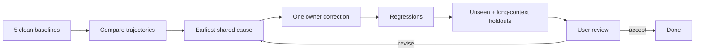

# Instruction evaluation

## Structure

```text
frontmatter
  name · trigger · capability

SKILL.md
  outcome · routes · decisions

reference.md
  conditional depth omitted safely from other tasks
```

Group related topics. One policy, one owner.

## Example contract

```text
title
→ connected BAD/GOOD block
→ minimum surrounding code
→ current cloned-source path when dependency semantics apply
```

```text
BAD: same behavior · one failure
GOOD: direct refactor · verified API · cross-rule valid · construction
```

Rewrite any example requiring explanatory prose. Imports and unrelated surrounding code are outside example scope.

## Cross-check

```text
all instructions
+ enforcement
+ linked cloned source
+ every GOOD example
```

Reject incompatible examples, stale APIs, semantic duplicates, unsafe exceptions, trigger collisions, and metadata drift.

## Fixture

```text
Allow:
  instructions
  skill metadata
  cloned repositories
  enforcement config and custom-rule source/tests
  neutral synthetic task and fixture

Exclude:
  apps/*
  production package implementations
  git and conversation history
  other-run artifacts
```

Run at least five clean generations per task. Parallelize per `AGENTS.md#Delegation`; use the primary model for unseen holdouts. Invalidate forbidden-source access.

## Trajectory

| Point | Snapshot                                                   |
| ----- | ---------------------------------------------------------- |
| `P0`  | tree before first formatter, fixer, or mutating validation |
| `P1`  | tree immediately after the first fixer                     |
| `Pn`  | tree after each evidence-driven correction                 |
| `PF`  | submitted tree                                             |

Run read-only checks against a copy of `P0`.

| Observe      | Evidence                                                         |
| ------------ | ---------------------------------------------------------------- |
| Sources      | ordered reads/searches before first edit; missed or forbidden    |
| Assumptions  | unsupported choices identified from actions and artifacts        |
| Stalls       | repeated actions without new evidence, decision, or artifact     |
| Failures     | command/tool error classified by cause                           |
| Iterations   | edit → new evidence → edit                                       |
| Autofix      | exact `P0 → P1` and later fixer changes                          |
| Architecture | contract · owner · primitive · boundary · lifetime · current API |
| Minimality   | construction · no semantic duplicate · no remaining cleanup      |

Inspect architecture at `P0` and `PF`. A clean `PF` does not erase poor `P0`, avoidable stalls, or semantic autofix churn.

## Correction



Systemic cause: repeated in two independent runs or matching a repeated user correction. Change one owner at a time. Accept only improved first-pass trajectory, non-regressed final quality, passing holdouts, and user approval.
