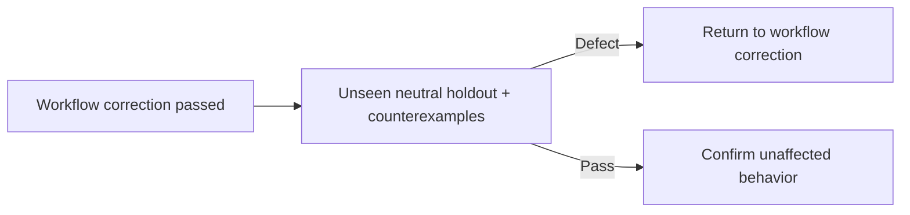

# Agent and skill evaluation

Use the smallest neutral fixture derived from each agent or skill metadata and body.

| Gate          | Proof                                                                                                                                                       |
| ------------- | ----------------------------------------------------------------------------------------------------------------------------------------------------------- |
| Routing       | A minimal positive trigger selects the component; a near miss does not; no collision or body policy exists in metadata.                                     |
| Behavior      | The component receives only decision-relevant information, derives available facts, and follows authority, tool, reference, and artifact boundaries.        |
| Integration   | `AGENTS.md`, metadata, bodies, references, configuration, static checks, and neighbors have compatible interfaces and one responsible component per policy. |
| Repeatability | Three independent runs converge through long context, local steering, and reconciliation; approval does not leak to a successive action.                    |

| Neutral holdout      | Required behavior                                                                                                                                                |
| -------------------- | ---------------------------------------------------------------------------------------------------------------------------------------------------------------- |
| Writing persistence  | Primary and subagent output remains compact, complete, unambiguous, and schema-conformant through a long tool-heavy turn.                                        |
| Compaction           | After lossy compaction, each retained representation preserves its relationships, order, branching, mappings, hierarchy, scope, and validity without prose glue. |
| Primary boundary     | Primary has only read, skill, and subagent tools and delegates mutation to Implementation and Git operations to Git.                                             |
| Shared source        | The V2 context-hook plugin supplies ambient instructions to every agent; root `AGENTS.md` remains repository-specific.                                           |
| Approved execution   | Implementation completes approved requirements, runs exact repository validation, then runs `deslop-linter` for non-Markdown changes.                            |
| Product design       | `engineering` loads for general design; `project-engineering` additionally loads only for this repository's architecture or visual system.                       |
| Role capabilities    | Every role can load an applicable skill and read configured references; shared instructions enter each role's context once.                                      |
| Visual scope         | Functional UI uses repository shadcn semantic tokens; portfolio work retains an independent visual direction.                                                    |
| Unrelated delegation | Independent work uses fresh applicable agents and preserves parallel dispatch.                                                                                   |
| Related delegation   | A follow-up reuses its agent unless that assignment's evidence changed; a correction requires fresh Review only for affected proof questions.                    |
| Review scope         | Each Review receives one bounded proof question; one request combining independent Owners or proof questions fails evaluation.                                   |
| Git ownership        | Git owns every Git or GitHub operation and loads only operation-matching references.                                                                             |
| V2 reload            | Workflow changes do not require an OpenCode restart before proof.                                                                                                |
| Explore ownership    | Explore returns only decision-relevant findings for broad, external, multi-source, or conversation-history investigation.                                        |
| Explore depth        | A defect investigation tests plausible causes and identifies the reusable cause and responsible component instead of stopping at a symptom.                      |
| Representation scope | A request to shorten communicated paths does not change stored reference declarations.                                                                           |
| Failure reporting    | Each agent reports every execution failure to its parent; the primary reports each distinct failure once, including recovered failures.                          |
| Continuation         | Completion of a secondary objective continues the actionable approved parent objective.                                                                          |
| Approval isolation   | Approval covers its objective and coupled corrections; it does not authorize a successive unrelated or expanded action.                                          |
| Canonical approval   | Primary and user brainstorm the goal and smallest viable outcome, then approve requirements, non-goals, acceptance criteria, and decisions once.                 |
| Dispatch economy     | Each specialist receives only its role input plus non-derivable decisions, inaccessible or ephemeral evidence, and decision-changing conflicts or issues.        |
| Current grounding    | Implementation continuously derives technical facts from current source and configured references; stale reads are invalidated only by the shared validity rule. |
| Complete ownership   | Each specialist completes its assigned role without delegating it or returning unfinished work upward.                                                           |
| Issue persistence    | Every distinct issue remains visible through completion until resolved or explicitly transferred.                                                                |

| Holdout input              | Status   |
| -------------------------- | -------- |
| Source conversations       | Excluded |
| Prior-run artifacts        | Excluded |
| Production implementations | Excluded |
| Git history                | Excluded |
| Expected findings          | Excluded |
| Invented domain policy     | Excluded |
