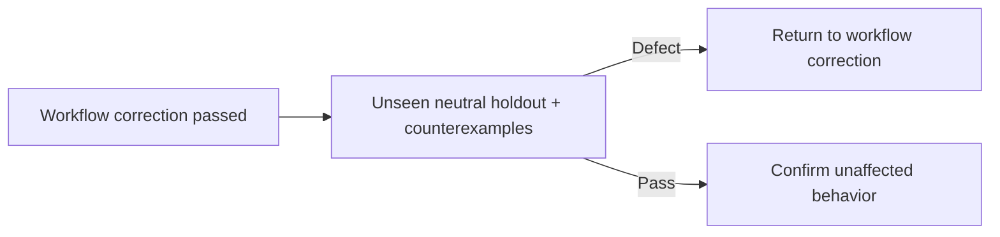

# Agent and skill evaluation

Use the smallest neutral fixture derived from each agent or skill metadata and body.

| Gate          | Proof                                                                                                                                                       |
| ------------- | ----------------------------------------------------------------------------------------------------------------------------------------------------------- |
| Routing       | A minimal positive trigger selects the component. A near miss does not. Metadata contains no collision or body policy.                                      |
| Behavior      | The component receives only decision-relevant information, derives available facts, and follows authority, tool, reference, and artifact boundaries.        |
| Integration   | `AGENTS.md`, metadata, bodies, references, configuration, static checks, and neighbors have compatible interfaces and one responsible component per policy. |
| Repeatability | Three independent runs converge through long context, local steering, and reconciliation. Approval does not leak to a successive action.                    |

| Neutral holdout        | Required behavior                                                                                                                                                                                                                                                                                                                                                                                                                                                                             |
| ---------------------- | --------------------------------------------------------------------------------------------------------------------------------------------------------------------------------------------------------------------------------------------------------------------------------------------------------------------------------------------------------------------------------------------------------------------------------------------------------------------------------------------- |
| Writing persistence    | Primary and subagent output remains compact, complete, unambiguous, and schema-conformant through a long tool-heavy turn.                                                                                                                                                                                                                                                                                                                                                                     |
| Compaction             | After lossy compaction, each retained representation preserves its relationships, order, branching, mappings, hierarchy, scope, and validity without prose glue.                                                                                                                                                                                                                                                                                                                              |
| Primary boundary       | Primary delegates mutation to Implementation and Git operations to Git.                                                                                                                                                                                                                                                                                                                                                                                                                       |
| Shared source          | The V2 context-hook plugin supplies ambient instructions to every agent. Root `AGENTS.md` remains repository-specific.                                                                                                                                                                                                                                                                                                                                                                        |
| Approved execution     | Implementation follows one fail-fast chain: Markdown-only changes run exactly `vp run fix`; any non-Markdown change runs exactly `vp run fix && vp run check && vp run test && deslop-linter`; corrections to implementation, validation, or linter failures restart the applicable complete chain.                                                                                                                                                                                           |
| Implementation scope   | Implementation metadata states its purpose; its body contains only edit-specific validation sequencing, correction restart, enforcement-integrity, and linter-scope rules. Shared Behavior and Communication retain approved-scope, preservation, and reporting ownership.                                                                                                                                                                                                                    |
| Enforcement integrity  | Implementation keeps configured checks active unless the approved objective explicitly changes enforcement.                                                                                                                                                                                                                                                                                                                                                                                   |
| Linter scope           | Implementation uses no `deslop-linter` scope flag unless the approved objective explicitly requires that scope.                                                                                                                                                                                                                                                                                                                                                                               |
| Check ownership        | Only Implementation runs validation, lint, test, format, build, or check commands. Every other role trusts its completed results.                                                                                                                                                                                                                                                                                                                                                             |
| Assigned state         | Shared Behavior preserves repository, Git, remote, process, network, product, and external state except for mutations assigned to the current role. Roles do not duplicate this policy.                                                                                                                                                                                                                                                                                                       |
| Follow-up freshness    | Primary reuses a specialist session only while its effective instructions and configuration remain unchanged.                                                                                                                                                                                                                                                                                                                                                                                 |
| Parallel dispatch      | Primary dispatches independent assignments in parallel when this shortens the critical path. Dependent assignments and independent work that cannot shorten it remain ordered.                                                                                                                                                                                                                                                                                                                |
| Product design         | `engineering` loads for general design. `project-engineering` additionally loads only for this repository's architecture or visual system.                                                                                                                                                                                                                                                                                                                                                    |
| Role capabilities      | Every role can load an applicable skill and read configured references. Shared instructions enter each role's context once.                                                                                                                                                                                                                                                                                                                                                                   |
| Visual scope           | Functional UI uses repository shadcn semantic tokens. Portfolio work retains an independent visual direction.                                                                                                                                                                                                                                                                                                                                                                                 |
| Review scope           | Each Review receives only a minimal approved-requirements brief and its diff, with no implementation results, expected defects, prior findings, suggested concerns, or fixes. It defaults to the uncommitted diff and uses the corresponding derived comparison when the brief names a branch, pull request, or commit. It preserves all state and tests every requirement, direct dependency, and valid counterexample. One request combining independent responsibilities fails evaluation. |
| Review output          | A clean review is exactly `No issues`. A defective review is only the specified `Severity`, `Defect`, and `Evidence + root cause` table, with one row per deduplicated defect and no passing findings.                                                                                                                                                                                                                                                                                        |
| Git ownership          | Git owns every Git or GitHub operation and overrides the central denials for argument-bearing `git` and `gh`.                                                                                                                                                                                                                                                                                                                                                                                 |
| V2 reload              | Workflow changes do not require an OpenCode restart before proof.                                                                                                                                                                                                                                                                                                                                                                                                                             |
| Explore search         | Explore continues through plausible sources and naming or location variants until the assigned fact is resolved or evidence is exhausted.                                                                                                                                                                                                                                                                                                                                                     |
| Explore classification | Explore classifies information as observed, inferred, or unresolved and supplies inline evidence.                                                                                                                                                                                                                                                                                                                                                                                             |
| Explore depth          | A defect investigation tests mechanisms and plausible causes, then follows dependencies to the reusable cause and responsible component instead of stopping at a symptom.                                                                                                                                                                                                                                                                                                                     |
| Explore history        | A session-history investigation reconstructs persisted order and agent lineage, applies the latest compaction boundary, and distinguishes persisted history from model-visible context.                                                                                                                                                                                                                                                                                                       |
| Shared reporting       | Communication defines nonempty applicable `Changed`, `Findings`, `Git`, `Issues`, `Blocked`, and `Next` sections. Shared issues form one flat impact-ordered list unless a role-specific defect schema requires a table. When prior sections exist, a thematic break appears immediately before `Next`, without an empty wrapper or whitespace-only separator. Role-specific exact outputs supersede shared sections.                                                                         |
| GFM structure          | Communication uses a monotonic heading hierarchy without nested H1s, skipped levels, or pseudo-headings; uses real headings, tables, or inline labels supported by the surrounding structure; explicitly groups related content; surrounds headings, tables, lists, callouts, and code blocks with blank lines; and keeps GFM spacing consistent. Embedded artifacts continue the host heading hierarchy.                                                                                     |
| Failure reporting      | Unresolved failures appear under `Issues` or `Blocked`. Recovered failures with no remaining impact are omitted.                                                                                                                                                                                                                                                                                                                                                                              |
| Message scope          | Git derives a commit title and bullet body only from the pending delta against `HEAD`. Git separately derives and regenerates a pull-request title and structured body from the complete branch diff against its target.                                                                                                                                                                                                                                                                      |
| Git approval           | Normal non-protected mutations need no separate approval. Protected branches permit reads, fetches, and `git pull --rebase`, and may supply feature branches, but agents never commit to or push them. The user owns every protected-branch merge on GitHub. Destructive or history changes, including force-push, are last-resort operations requiring direct user approval that agents cannot grant.                                                                                        |
| Git output             | A completed commit reports its message and hash. A pull request reports its title and URL.                                                                                                                                                                                                                                                                                                                                                                                                    |
| Draft lifecycle        | Primary dispatches only necessary pre-mutation Git preparation. An existing pull request becomes draft before workspace mutation; a new pull request opens draft; an updated pull request remains draft. Agents never mark ready, approve, or merge.                                                                                                                                                                                                                                          |
| Atomic checkpoint      | Before committing, one checkpoint dispatch resolves the remote branch and associated pull request, commits, pushes when the remote exists, fully updates an existing draft pull request, and returns only after completion. Opening a new pull request remains explicit. A second dispatch is not required to discover or update an existing pull request.                                                                                                                                    |
| Approval isolation     | Approval covers its objective and coupled corrections. It does not authorize a successive unrelated or expanded action.                                                                                                                                                                                                                                                                                                                                                                       |
| Issue persistence      | Every distinct issue remains visible through completion until resolved or explicitly transferred.                                                                                                                                                                                                                                                                                                                                                                                             |
| Mechanism proof        | Mechanism-dependent work proves current behavior through the actual mechanism and covers at least one valid counterexample before completion.                                                                                                                                                                                                                                                                                                                                                 |
| Browser defaults       | Primary establishes stable browser defaults once. Browser uses the latest installed CLI, one worktree-scoped task session, React, React DevTools, desktop acceptance, available ffmpeg, fresh shell calls, state waits, and `/tmp/opencode/agent-browser/<session>`; mobile is added only for an affected interface that supports it.                                                                                                                                                         |
| Browser sequencing     | When rendered acceptance needs a running interface, Implementation supplies a runnable URL before Browser starts. Browser exhaustively checks affected acceptance, always inspects errors and console, and uses other diagnostics only when acceptance requires them.                                                                                                                                                                                                                         |
| Browser evidence       | Browser uses a small verified core catalogue and installed help for uncommon syntax, refreshes stale snapshot references, uses `batch --bail` plus a stable selector for an atomic trace, closes its session, deletes non-issue artifacts, and reports exact GFM with required `Findings`, defect-conditional `Issues`, and retained issue-artifact paths inside `Findings`.                                                                                                                  |
| Shell policy           | The central policy allows broad shell; denies argument-bearing `npm`, `pnpm`, `yarn`, `bun`, `npx`, `bunx`, and `gh`; denies bare and argument-bearing `git commit` and `git push`; and denies argument-bearing `git merge`. Other Git commands remain enabled. No agent has shell policy except Git overrides for `git *` and `gh *`.                                                                                                                                                        |

| Holdout input              | Status   |
| -------------------------- | -------- |
| Source conversations       | Excluded |
| Prior-run artifacts        | Excluded |
| Production implementations | Excluded |
| Git history                | Excluded |
| Expected findings          | Excluded |
| Invented domain policy     | Excluded |

## Message-scope fixture

Given a branch that already adds query filtering and a pending delta that adds only a clear action:

| Artifact     | Required result                                                                                          |
| ------------ | -------------------------------------------------------------------------------------------------------- |
| Commit       | Title `feat(search): add clear action`; bullet body mentions only clearing the active query              |
| Pull request | Title `feat(search): add query controls`; body covers both query filtering and clearing the active query |

The evaluation fails if the commit reuses the pull-request title or includes the earlier filtering change.
