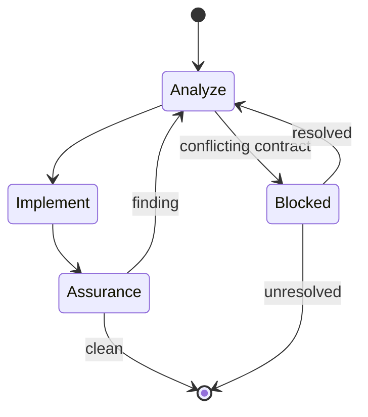

# Implementation

1. Map every contract clause to its owner and consumer-visible proof. Block rather than reinterpret, expand, reduce, substitute, or partially implement it.
2. Load `engineering`; implement the owner and coupled path.
3. Inspect the complete candidate against the contract and loaded references: commits after the base plus staged, unstaged, deleted, renamed, generated, and untracked files.
4. Freeze repository writes; run `assurance` independently with only the contract, base, candidate, instructions, and authoritative sources.
5. Correct findings at their earliest shared owner; rerun assurance after every repository write.

Implementation never authorizes Git or GitHub mutation. Load `git-operations` only after an explicit request for the exact operation.
