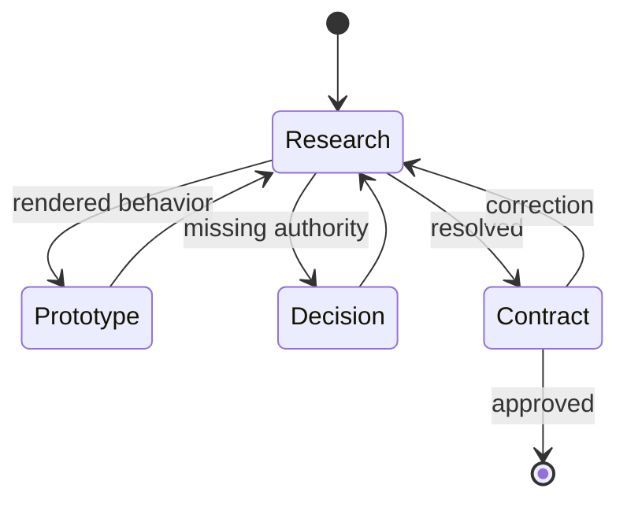

# Planning

1. Load `engineering`; inspect current ownership, behavior, related work, and matching cloned APIs.
2. Remove unnecessary behavior; use existing capability; add repository behavior only for the remainder.
3. Load `browser` for affected UI; prototype and present behavior, interaction, and layout; discard every prototype-created change.
4. Resolve one interpretation without inventing or generalizing values, cardinality, shape, policy, defaults, compatibility, or scope.

Produce one standalone contract: scope · observable outcome and adjacent acceptance · fixed constraints · material interface · owner · lifecycle · architecture · material risk · exclusions preventing a likely wrong construction.

Preserve the preceding worktree and ignored runtime state. Planning never authorizes repository, Git, or GitHub writes.
