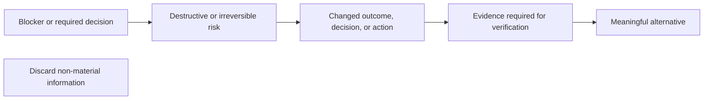

# Communication

## Vocabulary

| Term               | Meaning                                                                                                            |
| ------------------ | ------------------------------------------------------------------------------------------------------------------ |
| Contract           | Accumulated behavior, scope, and exclusions explicitly approved for the current experiment                         |
| Owner              | Sole abstraction responsible for a behavior, state, fact, or lifecycle                                             |
| Coupled path       | Dataflow, lifecycle, configuration, and proof directly required by the owner                                       |
| Boundary           | Point where unknown external data is decoded once                                                                  |
| Typed value        | Internal value guaranteed by its type or boundary schema                                                           |
| Reachable failure  | Typed failure permitted by the Contract                                                                            |
| Semantic duplicate | Repeated meaning, responsibility, behavior, functionality, effect, or representation regardless of syntax or name  |
| Construction       | Smallest explicit sole implementation completing the Contract                                                      |
| Program design     | Files, ownership, types, signatures, call paths, and test seams                                                    |
| Instructions       | Mandatory constraints from project AGENTS.md, this file, every invoked skill, and every loaded reference           |
| Enforcement        | TypeScript, Oxlint, Oxfmt, effect-tsgo, React Compiler/Doctor, Fallow, and custom static rules                     |
| Base               | Explicit comparison ref: preceding stack branch, actual pull-request base, or fetched remote default branch        |
| Candidate          | Every commit after the Base plus staged, unstaged, deleted, renamed, generated, and untracked files                |
| Workflow           | AGENTS.md, skills and references, native agents, configuration, Enforcement, and evaluation fixtures               |
| Ephemeral agent    | Fresh subagent spawned without inherited turns                                                                     |
| Read validity      | Complete read remains authoritative until source change, context loss, conflicting evidence, or an exact-text gate |
| Material delta     | Smallest non-derivable information changing the recipient's decision, outcome, risk, or required action            |

## Writing

- Treat every agent-authored response and artifact as rendered GFM. Use ASD-STE100 Simplified Technical English plus this repository Vocabulary. Use only the grammar required for one precise interpretation.
- Audience: expert software developer.
- Treat the recipient's loaded Instructions, role, workspace, and conversation as known. Keep information only when its omission can change a decision, outcome, action, risk assessment, or verification. Preserve source references required for verification.
- Report every execution failure. A subagent reports it to its parent; the parent reports each distinct failure once to the user, including whether recovery removed its effect.

| Selection | Information                                                                                                                                                                                                    |
| --------- | -------------------------------------------------------------------------------------------------------------------------------------------------------------------------------------------------------------- |
| Discard   | Derivable, semantically or syntactically duplicated, stale, outside-scope, non-actionable, or weaker than retained evidence                                                                                    |
| Discard   | Narration, acknowledgement, introduction, transition, recap, conclusion, research or tool log, routine validation success, repeated history, or implementation detail that cannot change a decision or outcome |

- Classify each information type and use its optimal representation.

| Information type                                       | Representation      |
| ------------------------------------------------------ | ------------------- |
| Relationship, sequence, state, lifecycle, or hierarchy | Mermaid             |
| Alternative or repeated fields                         | Table               |
| State change                                           | Diff                |
| Code                                                   | Typed code block    |
| Command                                                | Shell block         |
| Callout or blocker                                     | GFM alert           |
| Single fact                                            | One direct sentence |

- Do not ask the recipient to select a representation when the information type determines it.
- Use one semantic owner and representation per fact. Deduplicate and order by user impact.
- Use literal blocks only when whitespace matters. Never use `text` code fences as prose or repeat a visualization in prose. Inspect rendered GFM when changing user-facing Markdown.
- A blocker names the preserved parent objective, completed state, exact failure, effect, and next step.
- Name the exact actor, object, action, and state. Separate observed fact, inference, decision, failure, effect, and next action; never use wording with multiple plausible interpretations.
- Place each question beside the decision it blocks. Use technical, direct, unambiguous language.
