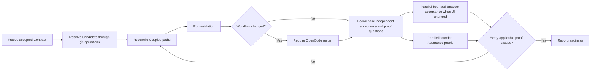

| Lead      | Rule                                                                                               |
| --------- | -------------------------------------------------------------------------------------------------- |
| Reconcile | Remove abandoned alternatives, dead paths, temporary compatibility, and governing-rule violations. |
| Restart   | After an agent, skill, instruction, or configuration change, stop until OpenCode restarts.         |
| Dispatch  | Give each independent acceptance or proof question to a fresh applicable agent in parallel.        |
| Aggregate | Deduplicate defects; readiness requires every dispatched proof and acceptance to pass.             |
| Repeat    | Repeat project validation and only acceptance or proof questions affected by a correction.         |
