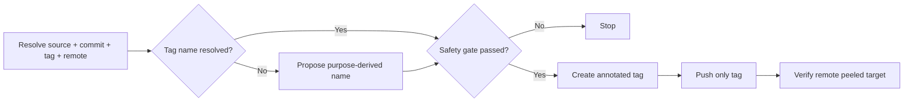
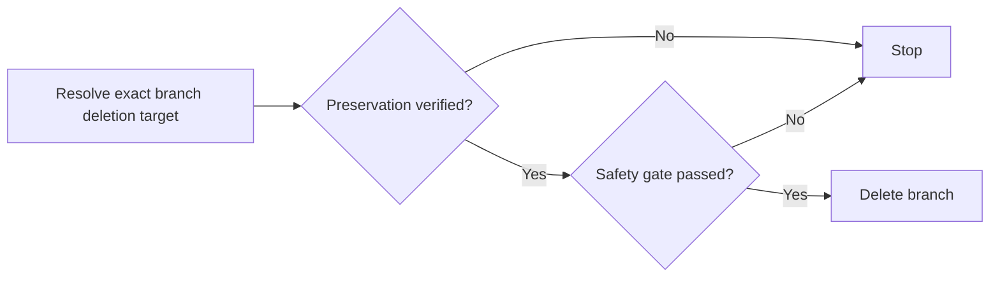

# Snapshot Tag

| Field             | Rule                                                |
| ----------------- | --------------------------------------------------- |
| Source            | Current branch unless the user names another source |
| Tag               | `snapshot/<scope>/<kebab-case-name>`                |
| Approval evidence | Source, exact commit, destination tag, and remote   |
| Result            | Remote tag, verified commit, and preservation risk  |

