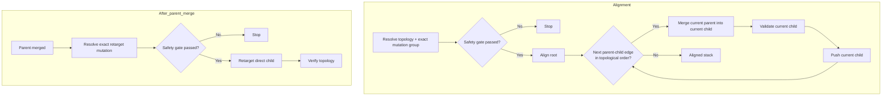

# Stacked Pull Requests

Keep every review boundary valid without rewriting published history.

## Topology invariants

| Node  | Base             | Invariant                              |
| ----- | ---------------- | -------------------------------------- |
| Root  | Default branch   | Independently understandable and valid |
| Child | Immediate parent | Independently understandable and valid |

## Read-only inspection

```bash
gh stack view
```

## Creation after Safety approval

```bash
gh stack add
```

## Publication after Safety approval

```bash
gh stack submit
```

In `gh stack submit`, set every pull request to draft; never use `--open`.

## Published alignment



## Topology

| Branch | Base | Pull request | Draft state | Revision |
| ------ | ---- | ------------ | ----------- | -------- |
| ...    | ...  | ...          | ...         | ...      |
