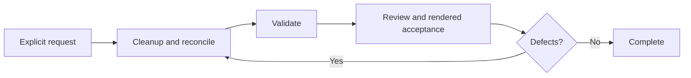

| Lead      | Rule                                                                                               |
| --------- | -------------------------------------------------------------------------------------------------- |
| Reconcile | Remove abandoned alternatives, dead paths, temporary compatibility, and governing-rule violations. |
| Dispatch  | Give each independent proof to Review and rendered acceptance to Browser in parallel.              |
| Correct   | Primary corrects defects within the accepted Contract.                                             |
| Aggregate | Deduplicate defects; readiness requires every dispatched proof and acceptance to pass.             |
| Repeat    | Repeat project validation and only acceptance or proof questions affected by a correction.         |
