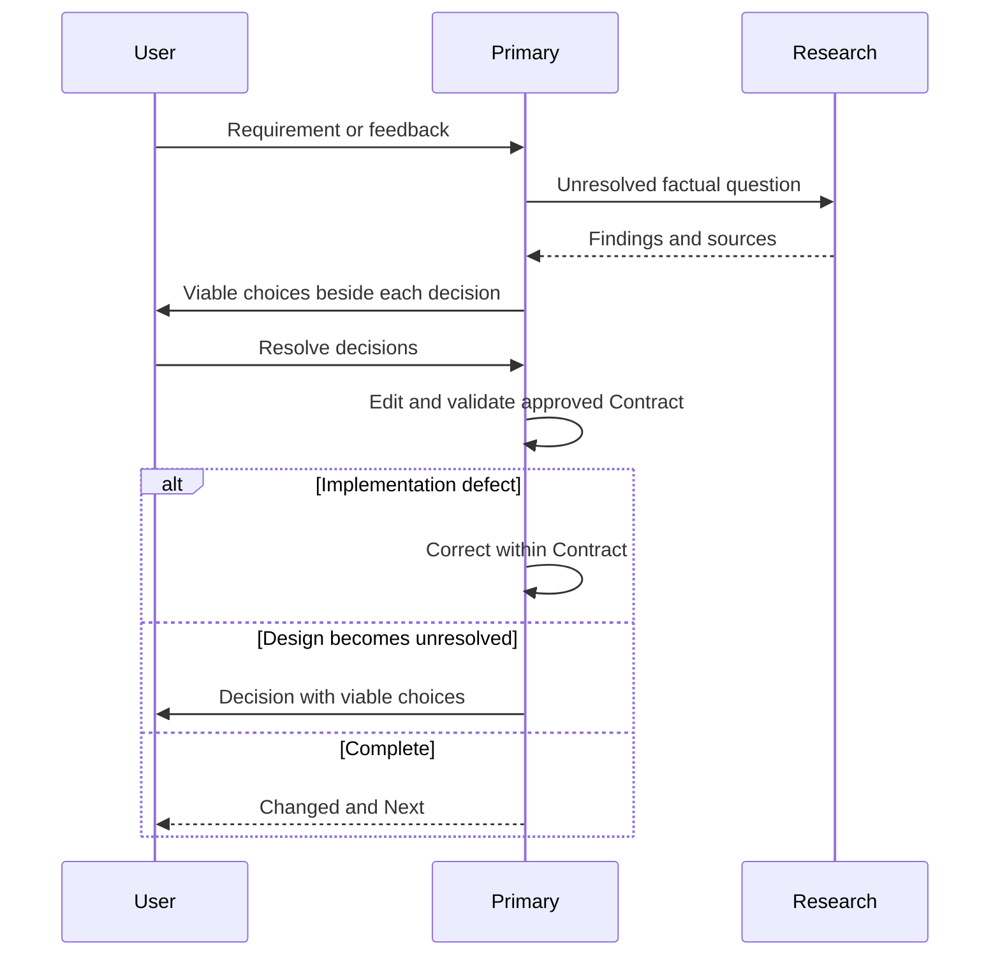

## Flow



## Collaboration

| Condition                                         | Required action                                           |
| ------------------------------------------------- | --------------------------------------------------------- |
| Planning, prototyping, or brainstorming requested | Return the design artifact; edit only after approval.     |
| Unresolved requirement or design                  | Keep the question beside the blocked decision.            |
| Approved Contract needs a material design change  | Return the changed design for approval.                   |
| Safe checkpoint                                   | Primary edits and validates immediately without approval. |

## Result

For each unresolved decision, use:

```markdown
## <Decision>

### A — <name>

- **Change:** Materially viable Construction.
- **Tradeoff:** Decision-changing cost.

### B — <name>

- **Change:** Materially viable Construction.
- **Tradeoff:** Decision-changing cost.
```

The alternatives are the implicit selection question. Add an explicit shared question directly under its decision only when the user must provide information that the alternatives cannot express.
