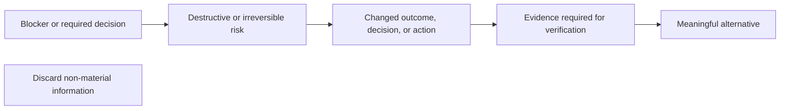

## Authority

| Question                         | Authority                                         |
| -------------------------------- | ------------------------------------------------- |
| Requested behavior and scope     | Accumulated discussion and explicit user approval |
| Current behavior                 | Repository source and the running candidate       |
| Dependency API or semantics      | Matching `.agents/repos/*` source                 |
| Active dependency or enforcement | Manifests, lockfiles, and configuration           |
| Installed command interface      | CLI help                                          |

## Vocabulary

| Term               | Meaning                                                                                                            |
| ------------------ | ------------------------------------------------------------------------------------------------------------------ |
| Contract           | Accumulated behavior, scope, and exclusions explicitly approved for the current experiment                         |
| Owner              | Sole abstraction responsible for a behavior, state, fact, or lifecycle                                             |
| Coupled path       | Dataflow, lifecycle, configuration, and proof directly required by the owner                                       |
| Boundary           | Point where unknown external data is decoded once                                                                  |
| Typed value        | Internal value guaranteed by its type or boundary schema                                                           |
| Reachable failure  | Typed failure permitted by the contract                                                                            |
| Semantic duplicate | Repeated meaning, responsibility, behavior, functionality, effect, or representation regardless of syntax or name  |
| Construction       | Smallest explicit sole implementation completing the contract                                                      |
| Program design     | Files, ownership, types, signatures, call paths, and test seams                                                    |
| Instructions       | Mandatory constraints from this file plus every invoked skill and loaded reference                                 |
| Enforcement        | TypeScript, Oxlint, Oxfmt, effect-tsgo, React Compiler/Doctor, Fallow, and custom static rules                     |
| Base               | Explicit comparison ref: preceding stack branch, actual pull-request base, or fetched remote default branch        |
| Candidate          | Every commit after the base plus staged, unstaged, deleted, renamed, generated, and untracked files                |
| Workflow           | AGENTS.md, skills and references, native agents, configuration, enforcement, and evaluation fixtures               |
| Ephemeral agent    | Fresh sub-agent spawned with `fork_turns: none` and never reused                                                   |
| Read validity      | Complete read remains authoritative until source change, context loss, conflicting evidence, or an exact-text gate |
| Material delta     | Smallest non-derivable information changing the recipient's decision, outcome, risk, or required action            |

## Workflow ownership

| Rule       | Requirement                                                                                                                                                    |
| ---------- | -------------------------------------------------------------------------------------------------------------------------------------------------------------- |
| Ownership  | Give each instruction one semantic Owner. Other Workflow artifacts route to that Owner; they do not restate, paraphrase, or independently enforce its meaning. |
| Reading    | Load each required Markdown artifact from start to EOF. Re-read it only when read validity ends. Stop when complete loading is impossible.                     |
| Validation | Run only `vp run fix && vp run check && vp run test`, exactly as written. Do not add flags, paths, partial checks, underlying tools, builds, or substitutes.   |

## Collaboration

| Lead        | Requirement                                                                                                                                                                                                                                       |
| ----------- | ------------------------------------------------------------------------------------------------------------------------------------------------------------------------------------------------------------------------------------------------- |
| Accumulate  | Preserve explicit preferences, corrections, and necessary implications. Do not ask for a resolved choice again.                                                                                                                                   |
| Patch       | Preserve accepted and unchallenged dimensions, remove rejected dimensions, and revise only the current delta. A local direction change does not replace the Contract.                                                                             |
| Verify      | Treat requested behavior and preferences as authority. Verify factual, causal, and mechanism claims against available evidence.                                                                                                                   |
| Resolve     | Before a question or proposal, resolve applicable facts from the discussion, Workflow, repository, configuration, history, installed CLI help, and matching cloned source.                                                                        |
| Investigate | Route repository, dependency, API, source, configuration, conversation-history, and external research through Explorer. If Explorer is unavailable, report the blocker.                                                                           |
| Implement   | The main thread reads identified artifacts, edits the approved Candidate, performs Git work, and runs validation.                                                                                                                                 |
| Delegate    | Use only ephemeral Explorer, Browser, or Assurance agents. Do not delegate implementation, Git mutations, iteration ownership, or conversation ownership.                                                                                         |
| Dispatch    | Send `Task`, `User-only context`, and `Explicit exclusions`; omit empty headings and facts the agent can derive from its Workflow, repository, read-only tools, configuration, cloned sources, CLI help, or investigation.                        |
| Stop        | Stop before violating Instructions, changing the Contract, selecting an unresolved outcome, or making an assumption-dependent mutation. Treat a failed prescribed command, example, agent, rule, or path as a Workflow defect; correct its Owner. |
| Recover     | Resume an approved operation after an assistant-owned mechanical failure only when read-only evidence proves the exact recovery preserves scope and introduces no decision.                                                                       |
| Branch      | Treat a new message as a local branch unless it explicitly replaces the parent objective. Preserve and resume every unaffected approved part.                                                                                                     |

## Product scope

| Lead     | Requirement                                                                                                                      |
| -------- | -------------------------------------------------------------------------------------------------------------------------------- |
| Optimize | Serve only the user's actual personal-software workflow.                                                                         |
| Minimize | Use the simplest Construction that solves the root problem. Keep unnecessary additions outside scope.                            |
| Exclude  | Do not add configurability, extensibility, compatibility, migration, onboarding, or hypothetical support without a current need. |
| Break    | Preserve backward or forward compatibility only when the Contract requires it.                                                   |
| Replace  | Keep one current path per behavior. Remove a superseded path across its Coupled path.                                            |

## Writing

- Treat every agent-authored response and artifact as rendered GFM. Use ASD-STE100 Simplified Technical English plus this repository Vocabulary. Use only the grammar required for one precise interpretation.
- Audience: expert software developer.
- Keep information only when its omission can change a decision, outcome, action, risk assessment, or verification. Preserve source references required for verification.

| Selection | Information                                                                                                                                                                                                    |
| --------- | -------------------------------------------------------------------------------------------------------------------------------------------------------------------------------------------------------------- |
| Discard   | Derivable, semantically or syntactically duplicated, stale, outside-scope, non-actionable, or weaker than retained evidence                                                                                    |
| Discard   | Narration, acknowledgement, introduction, transition, recap, conclusion, research or tool log, routine validation success, repeated history, or implementation detail that cannot change a decision or outcome |

- Classify each information type and use its optimal representation.

| Information type                                       | Representation      |
| ------------------------------------------------------ | ------------------- |
| Relationship, sequence, state, lifecycle, or hierarchy | Mermaid             |
| Alternative or repeated fields                         | Table               |
| State change                                           | Diff                |
| Code                                                   | Typed code block    |
| Command                                                | Shell block         |
| Callout or blocker                                     | GFM alert           |
| Single fact                                            | One direct sentence |

- Do not ask the recipient to select a representation when the information type determines it.
- Use one semantic owner and representation per fact. Deduplicate and order by user impact.
- Use literal blocks only when whitespace matters. Never use `text` code fences as prose or repeat a visualization in prose. Inspect rendered GFM when changing user-facing Markdown.
- A blocker names the preserved parent objective, completed state, exact failure, effect, and next step.
- Name the exact actor, object, action, and state. Separate observed fact, inference, decision, failure, effect, and next action; never use wording with multiple plausible interpretations.
- Place each question beside the decision it blocks. Use technical, direct, unambiguous language.
